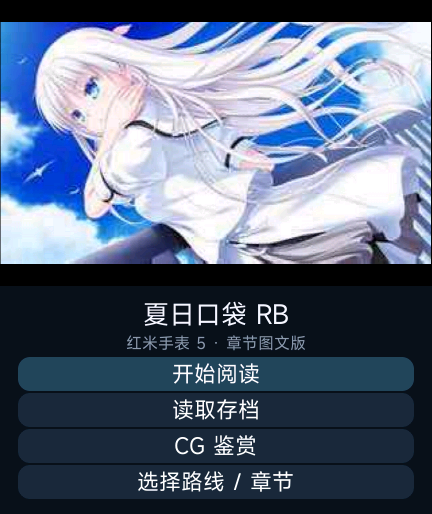
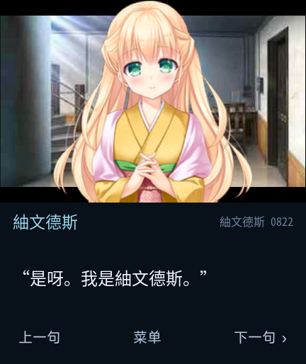

# 夏日口袋 · REDMI Watch 5

基于《Summer Pockets REFLECTION BLUE》Windows 版资源制作的 Xiaomi Vela 手表阅读版本。应用名称为“夏日口袋”，在 REDMI Watch 5 的 432 × 514 屏幕上提供对白阅读、角色立绘、剧情选择、章节导航、存档和 CG 鉴赏。

本项目参考 **[@liuyuze61](https://github.com/liuyuze61)** 的《ATRI 1.5.1》与《星空列车与白的旅行 v1.0.0》移植作品的实现方式，进一步完成《夏日口袋》的资源转换、播放器功能和图片适配。两部原作品链接见「参考作品与致谢」。

> 资料截至 2026-10-09。当前版本 **0.1.5**，修正人物姓名显示为“紬文德斯”，并补充缺失字形。0.1.5 已通过自动检查、官方原生模拟器检查及维护者的 REDMI Watch 5 上机测试；实机测试通过的反馈由维护者于 2026-10-09 提供。此前 0.1.4 的实机测试中图标正常显示，各项功能暂未发现异常。程序代码采用 MIT 许可证，原游戏资源不在代码许可范围内。

## 功能与本项目成果

- **大体量剧情转换**：96,936 条对白/旁白、191 处对白选择、315 个可选章节入口，按 16 个分类整理；标题可选择路线/章节。
- **完整角色立绘**：整理 277 张人物底图，映射原版角色资源。修复将局部眼睛、嘴巴补丁当成完整立绘的问题，保留透明边缘；最大尺寸 200 × 256。
- **改善立绘压缩质量**：取消早期 32 色方案，重新处理人物图片，使用 RGBA PNG。构建时保留已检查的 PNG，避免工具再次量化造成明显失真。
- **30 个存档栏位**：自行选择保存、加载栏位，覆盖前确认；支持标题读档与地图选择页面的存档恢复。
- **菜单内下一章**：阅读中直接跳章，并提供上一句、下一句、逐字/即时显示及字号切换。
- **分组 CG 鉴赏**：856 张 CG 按场景整理为 155 组，转换收录的 CG 全部开放。列表中同场景差分只占一项，打开后点击图片循环切换。
- **完整 CG 合成**：局部差分先合回对应原画布，再缩放和压缩，避免把眼睛、嘴巴等局部补丁当作一张完整 CG 展示。
- **地图选择适配**：将地图选点整理为可滚动的文字选项，保留可解析的原版分支编号。
- **包体与内存处理**：安装包控制在 25 MB 内；剧情按 1,024 条指令分块，只缓存当前块，限制历史和异常跳转，自动执行分批让出界面。
- **中文人物姓名**：人物标签、路线/章节与存档信息使用“紬文德斯”；对白保留原作简称“紬”。内嵌字体子集覆盖涉及该字的文本，不再用 `Tsumugi` 代替，也不依赖设备内置字体含有该字。
- **正式名称与图标**：应用列表使用原版封面裁剪的 192 × 192 PNG，修复黑色占位图标。

章节直达与全开放 CG 会提前展示后续剧情。

## 开发工具与分工

本项目的程序实现、资源转换、图像处理、手表界面适配、测试工具及文档整理由 **OpenAI Codex** 在维护者的需求与反馈指导下完成。维护者负责提出需求、提供原版资源、审查成果及完成 REDMI Watch 5 实机测试。

## 画面预览

| 标题界面 | 角色立绘 | 完整 CG |
| --- | --- | --- |
|  |  |  |

截图来自官方 Vela 原生模拟器。标题为 0.1.5，原立绘和 CG 示例为 0.1.3；0.1.5 的剧情与图像资源保持不变。姓名修复后的实际画面：



## 当前安装包

[下载当前版本及校验文件](https://github.com/xuanyide01/summer-rw5/releases/tag/v0.1.5)。

| 项目 | 内容 |
| --- | --- |
| 应用名称 | 夏日口袋 |
| 原版资源版本 | REFLECTION BLUE |
| 应用版本 | 0.1.5 / versionCode 6 |
| 包名 | `com.codex.summer.rw5` |
| BIN 文件 | `summer-rw5-v0.1.5.bin` |
| 文件大小 | **24,632,156 字节，约 24.63 MB** |
| 包内文件解压总大小 | 33,705,464 字节，不含安装工具额外开销 |

MB 按 1,000,000 字节计算，安装包上限为 **25,000,000 字节**。BIN 与同版本 RPK 内容相同，任选安装工具支持的格式；当前产物使用开发签名。安装后占用和运行内存另计。

```text
SHA256
a906940ef39821d7bfb82d2a5e38692b33078ad3cd961ee3a77d9da424e7069c
```

## 安装与使用

1. 使用支持 REDMI Watch 5 的 Vela 应用安装工具安装对应 BIN；已有实机测试使用「表盘自定义工具」（相关社区：[米坛社区 BandBBS](https://www.bandbbs.cn/)）。
2. **工具显示安装完成后，仍需等待一阵，手表端才会完成安装。** 等待应用与图标在列表中正常显示，再打开游戏；不要刚看到完成提示就反复重装。
3. 在应用列表打开“夏日口袋”，选择开始、加载、路线/章节或 CG 鉴赏。
4. 游戏内打开菜单选择保存、加载或下一章。保存时选定栏位；加载时自行选择所需栏位。
5. 出现地图选择时滚动文字选项并点击目标；CG 鉴赏中点击图片切换同场景差分。

包名和存档键保持不变。不同安装工具的覆盖安装行为可能不同，卸载可能清除存档；更新前请保留旧安装文件并记录版本。

## 适配与验证

当前目标为 **REDMI Watch 5**，界面按 **432 × 514** 设计；目前**小米手环 8 Pro 尚未适配**。

- 11 项自动测试通过，包含资源/跳转、30 槽、全部转换 CG、完整立绘及 TXT 读取/失败恢复检查。
- 457 个剧情分块与完整转换脚本流程的一致性比较通过；315 个章节按首项/末项两种选择策略共遍历 630 次，未穷举全部跨周目条件。
- 0.1.3 在原生模拟器中通过 30 个旧存档加载、8 名主要角色完整立绘、完整 CG、代表差分循环及旧地图存档恢复与分支跳转检查。
- 0.1.4 通过原生模拟器安装、启动、名称与图标资源检查；游戏代码和剧情图像资源与 0.1.3 逐字节相同，已有模拟器存档数据库未发生变化。
- 0.1.5 通过 30 个旧存档加载、路线/章节、中文姓名对白、字号切换、存档预览/覆盖/读取及 CG 差分的原生检查；姓名字体覆盖 4,637 处相关字段，全部原有运行资源与 0.1.4 逐字节一致。官方模拟器磁盘不足时，本次备份并保留虚拟存档后重装应用；不据此承诺所有安装工具的覆盖更新行为。
- **0.1.4 已完成 REDMI Watch 5 上机测试，应用图标正常显示，目前各项功能暂未发现异常。** 此项依据维护者于 2026-10-09 提供的实机反馈记录。
- **0.1.5 已完成 REDMI Watch 5 上机测试。** 此项依据维护者于 2026-10-09 提供的“夏日口袋通过上机测试”反馈记录，已确认姓名修正版本通过实机测试。

原生环境使用官方 `vela-watch-5.0` 镜像，并非 REDMI Watch 5 实际系统的完整复刻。实机与模拟器检查的范围以已测试设备和已检查内容为准，尚未覆盖所有设备、固件及长期运行情况。

## 开发与构建

在 Windows 的项目根目录执行，需 Node.js 与 npm，并已准备好 `src/common/` 下的转换资源和测试所需转换脚本数据：

```powershell
npm ci
npm install --prefix tools/compat-toolkit --ignore-scripts
npm test
npm run build
```

产物为 `dist/com.codex.summer.rw5.debug.0.1.5.rpk`。构建固定使用 **aiot-toolkit 1.1.0**，`tools/compat-toolkit` 将图片依赖 sharp 固定为 0.34.5；项目根目录的 2.0.5 依赖用于开发和模拟器工具。构建脚本检查 25,000,000 字节上限。

`quickapp.config.js` 在构建时保留检查过的 PNG 资源；当前包的 PNG/JPEG 与对应源文件逐字节一致。

`tools/build-name-font.py` 用 fontTools 从 Noto Sans Mono CJK SC（SIL OFL 1.1）提取姓名相关文本需要的字形，输出 `src/common/summer-name.otf`。字体已随源代码提供，常规构建无需重新生成；改动相关对白后需重建字体子集并运行字体覆盖检查。仅姓名相关文本使用该子集，其余文本使用系统字体。

```text
src/                  Vela 应用、界面与转换后的运行资源
converted-story/      用于转换流程验证的剧情数据
tools/                格式解析、图片处理、构建及模拟器工具
tests/                自动测试
native-test-results/  带实际版本号的原生检查记录
licenses/             第三方许可证
docs/images/          README 截图
```

资源研究工具包括 `luca_format.py`、`cz_images.py`、`compile_expressions.py`；立绘与 CG 处理工具包括 `restore-portraits.py`、`compress-portraits.py`、`compose-cg.py`。这些工具针对本次 PC 游戏资源版本，目前并非任意 Galgame 的一键转换器。仅公开代码和工具的仓库需先准备原版资源的转换结果，再构建。

运行原版资源分析与图片处理工具前，将环境变量 `SUMMER_GAME_ROOT` 设为原版 `SummerPocketsRB.exe` 所在目录。已转换资源的应用构建无需读取原版目录。

### 原生模拟器

```powershell
$env:STARRY_EMULATOR_HOME = Join-Path $env:LOCALAPPDATA 'VelaGalgameDev'
npm run emulator:setup
npm run emulator
```

两个项目共用 `STARRY_EMULATOR_HOME` 指定的 SDK 与虚拟设备目录。首次准备会联网下载官方 SDK 镜像，并在用户目录 `.vela/vvd/` 注册 432 × 514 的虚拟设备。

待虚拟系统完成启动后，另开终端进入本项目目录，安装已经构建的包：

```powershell
$rpkPath = (Resolve-Path 'dist/com.codex.summer.rw5.debug.0.1.5.rpk').Path
$installUrl = 'http://127.0.0.1:43125/install?rpk=' + [Uri]::EscapeDataString($rpkPath)
Invoke-RestMethod -Uri $installUrl
Invoke-RestMethod -Uri 'http://127.0.0.1:43125/start'
```

随后在浏览器打开 `http://127.0.0.1:43125/` 操作虚拟手表。停止应用与关闭虚拟设备可分别使用本地控制接口 `/stop`、`/shutdown`；关机时 HTTP 连接可能随进程退出而关闭，应检查虚拟进程已结束。

两个项目控制器使用相同端口和虚拟设备名称，不要同时运行；切换游戏时先关闭前一个控制器并冷启动虚拟设备。部分原生测试会写入测试存档，执行前备份自己的模拟器数据。模拟器磁盘容量有限，安装失败时检查可用空间及安装日志。

## 已知限制

- 本项目提供手表端视觉小说阅读功能，Windows 原版引擎没有在手表上运行。
- 不含音乐、配音、视频、复杂动画和完整多人立绘站位；背景与 CG 经过缩放、压缩。
- 同姿势、同服装的角色资源目前共用一个表情底图，未逐一还原全部表情差分。
- 乒乓球等小游戏的玩法未复现，可从章节入口阅读相关对白。
- 地图图标状态、部分原引擎接口及跨周目全局解锁条件未完整复现；章节直达方便阅读，不代表原版全部解锁流程已还原。

## 卡住或异常退出的处理

应用无响应但系统仍能操作时，退出后重新打开并加载最近手动存档。整个手表无响应时，按[小米官方电源键说明](https://www.mi.com/global/support/faq/details/KA-524524/)长按约 **18 秒**，出现标志后松开。黑屏无法启动时，参考[官方 FAQ](https://www.mi.com/uk/support/faq/details/KA-521474/)使用原配充电座充电至少 10 分钟，再尝试强制重启；仍无法恢复则联系售后。

应用只声明 `system.storage`、`system.file`、`system.prompt`，不包含固件或系统分区写入代码。包体限制及现有检查不能保证所有设备零崩溃。反馈问题时请提供设备型号、系统版本、应用版本、路线/章节和复现步骤。

## 参考作品与致谢

感谢 **[@liuyuze61](https://github.com/liuyuze61)** 的两部手表移植作品，为本项目的应用结构、资源组织和兼容性研究提供了参考：

- **ATRI 1.5.1**，作者 @liuyuze61：[原作品分享链接](https://api.bandbbs.cn/wftools/bandbbs.html?code=A&state=1820673)。
- **星空列车与白的旅行 v1.0.0**，作者 @liuyuze61：[原作品分享链接](https://api.bandbbs.cn/wftools/bandbbs.html?code=A&state=1841662)。
- 作者相关开源项目：[ATRI-miband](https://github.com/liuyuze61/ATRI-miband)。

表盘分享链接保留原分享地址，需要浏览器或「表盘自定义工具」访问。

《夏日口袋》的 LucaSystem 脚本与图片格式研究参考 **[wetor / LuckSystem](https://github.com/wetor/LuckSystem)**，其 MIT 许可证保留于 [licenses/LuckSystem-LICENSE](licenses/LuckSystem-LICENSE)。平台资料参考 [Xiaomi Vela JS 应用官方文档](https://iot.mi.com/vela/quickapp/)。

感谢 **「表盘自定义工具」的开发者及相关团队**提供安装工具，支持本项目的应用安装与实机测试。相关社区：[米坛社区 BandBBS](https://www.bandbbs.cn/)。

也感谢原作开发者、译者、相关开源工具作者与测试者。

## 原作官网

《Summer Pockets REFLECTION BLUE》：[夏日口袋原作官网](https://key.visualarts.gr.jp/summer_rb/)。

## 许可证与游戏资源

本项目自行编写的程序代码采用 [MIT 许可证](LICENSE)。第三方代码与工具保留各自许可证和署名，见 [第三方说明](THIRD_PARTY_NOTICES.md)。

原版剧本、立绘、CG、背景和标识属于相应权利人，不纳入本项目代码许可证。包含这些素材的完整安装包也不能仅凭代码的开源许可获得素材分发授权。MIT 许可只覆盖程序代码，原作素材的使用和分发仍受相应权利人的授权约束。请支持原作。

## 相关项目

[星空列车与白的旅行 · REDMI Watch 5](https://github.com/xuanyide01/starry-rw5)。
